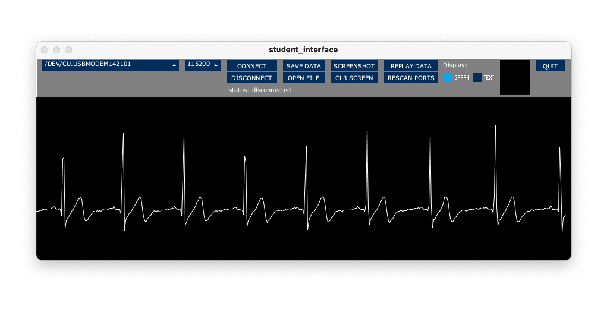

# Remote Bioelectronics for ES 53 - Fall 2020

Code for EMG / ECG labs in remote offering of ES 53, for use with Arduino UNO and Olimex shields

There are two separate but related elements in this repo:

1. The Arduino sketch (main.cpp) necessary to digitize the incoming signal, and
2. The Processing code students will use to connect to the device, visualize the signal, and save data in a .txt file.  

Development of (1) has taken place in Visual Studio Code within the PlatformIO extension.

